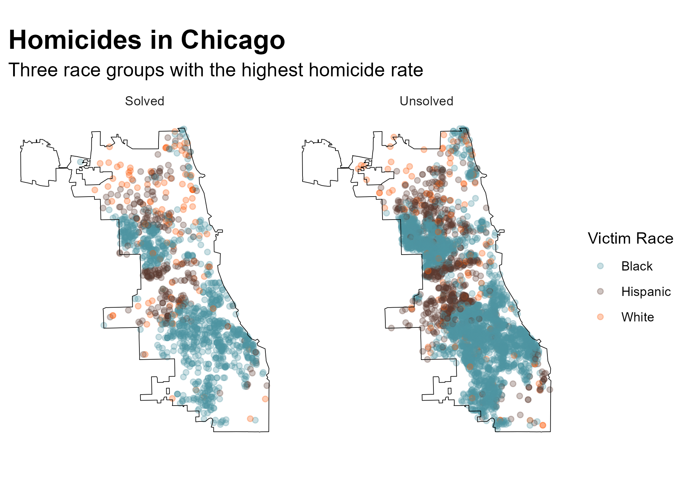
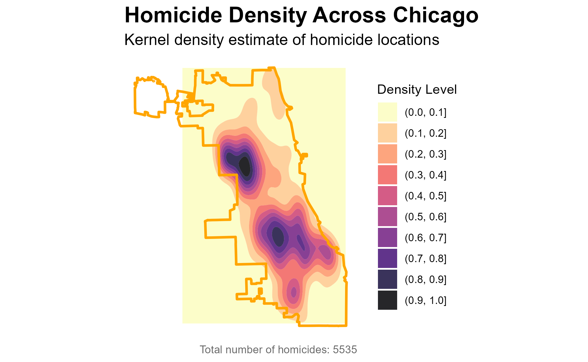

# EHRS535 Fall 2025

## Christopher Tsz Hin Choi

### In regards to Homework 5

-   Please find data and script and pdf for homework 5 in "/Homeworks/hwk5" folder

-   Wasington Post Homicide Data is saved in "/Homeworks/hwk5/data" folder

-   The output graph showing top 3 races (in desc order) homicides in a city facetted by solved/unsolved from the homework 5 is below:

#### Homicides by race across Chicago, IL

#### Homicide density across Chicago, IL

* Areas with highest homicide density in the area are in the darkest color contour

* Each lighter contour shows areas with proportionally lower relative density to the darkest contour